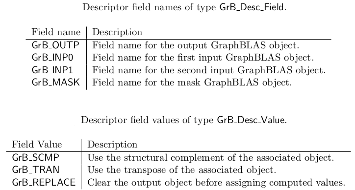
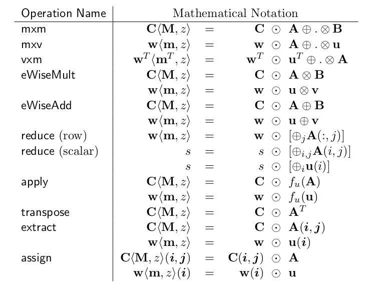
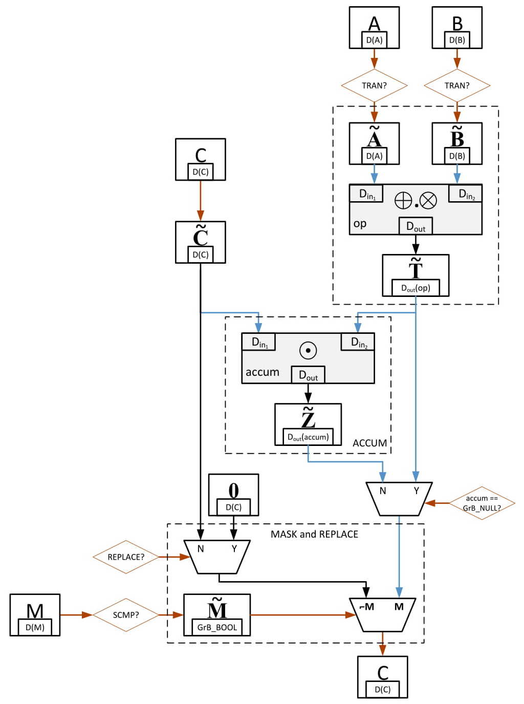

The GraphBLAS project is an open effort to define standard building blocks for graph algorithms in the language of linear algebra. 

I'll try to give a brief overview of the GraphBLAS API here, but for more details, it is best to refer to the API specification and the SuiteSparseGraphBLAS.jl documentation (work in progress).

First and foremost, you need to initialize GraphBLAS. `GrB_init` must called before any other GraphBLAS operation. `GrB_init` defines the mode that GraphBLAS will use:  blocking or non-blocking. With blocking mode, all operations finish before returning to the user application. With non-blocking mode, operations can be left pending, and are computed only when needed.


julia> using SuiteSparseGraphBLAS

julia> GrB_init(GrB_NONBLOCKING)
GrB_SUCCESS::GrB_Info = 0


All GraphBLAS functions return a code that indicates if it was successful or not (if more information is required, the `GrB_error` function can be called).

## GraphBLAS Predefined Types

|  GrB_Type  | Julia Type |
|:----------:|:----------:|
|  GrB_BOOL  |    Bool    |
|  GrB_INT8  |    Int8    |
|  GrB_UINT8 |    UInt8   |
|  GrB_INT16 |    Int16   |
| GrB_UINT16 |   UInt16   |
|  GrB_INT32 |    Int32   |
| GrB_UINT32 |   UInt32   |
|  GrB_INT64 |    Int64   |
| GrB_UINT64 |   UInt64   |
|  GrB_FP32  |   Float32  |
|  GrB_FP64  |   Float64  |

## Operators
### Unary operator: 
A GraphBLAS unary operator $$ F_{u} =〈D_{out}, D_{in}, f〉$$ is defined by two domains, $$D_{out}$$ and $$D_{in}$$, and an operation $$f:D_{in}→D_{out}$$ .
You can create a unary operator, by passing a function (which takes a single argument and maps the input to output) and the domains. Here is an example -

julia> AINV = GrB_UnaryOp()
GrB_UnaryOp

julia> function add_inv(a)
           return -a
       end
add_inv (generic function with 1 method)

julia> GrB_UnaryOp_new(AINV, add_inv, GrB_INT64, GrB_INT64)
GrB_SUCCESS::GrB_Info = 0


### Binary operator:
A GraphBLAS binary operator $$ F_{b} =〈D_{out}, D_{in1}, D_{in2},\odot〉$$ is defined by three domains, $$ D_{out}, D_{in1}, D_{in2} $$ and an operation: $$ \odot : D_{in1}×D_{in2}→D_{out}$$ . Similar to unary operators, you can create a binary operator as -

julia> ADD = GrB_BinaryOp()
GrB_BinaryOp

julia> function addition(a, b)
           return a+b
       end
addition (generic function with 1 method)

julia> GrB_BinaryOp_new(ADD, addition, GrB_INT64, GrB_INT64, GrB_INT64)
GrB_SUCCESS::GrB_Info = 0


## Monoids
A GraphBLAS monoid $$ M =〈D, \odot, 0〉$$ is defined by a single domain D, an associative operation $$ \odot : D × D → D $$ , and an identity element $$ 0 ∈ D $$ .

You can create a monoid with a binary operator and the identity value.

## Semirings
A GraphBLAS semiring (or semiring for short) $$ S =〈D_{out} , D_{in1} , D_{in2} , ⊕, ⊗, 0 〉$$ is defined by three
domains $$ D_{out}, D_{in1}, D_{in2} $$ ; an associative and commutative additive operation $$ ⊕ : D_{out} ×
D_{out} → D_{out}$$ ; a multiplicative operation $$ ⊗ : D_{in1} × D_{in2} → D_{out} $$ ; and an identity element $$ 0 ∈ D_{out} $$ .

Let $$ F = 〈D_{out} , D_{in1} , D_{in2} , ⊗〉$$ be an operator and let $$ A =〈D_{out} , ⊕, 0 〉$$ be a commutative monoid, then $$ S =〈A , F〉=〈D_{out} , D_{in1} , D_{in2} , ⊕, ⊗, 0 〉$$ is a semiring.

You can create a semiring with a monoid and binary operator.

## Vectors and Matrices
You're probably familiar with matrices and vectors, so let's see how you can build a vector or a matrix -


julia> V = GrB_Vector{Int64}()
GrB_Vector{Int64}

julia> GrB_Vector_new(V, GrB_INT64, 5)
GrB_SUCCESS::GrB_Info = 0

julia> I = [1, 2, 4]; X = [2, 32, 4]; n = 3;

julia> GrB_Vector_build(V, I, X, n, GrB_FIRST_INT64)
GrB_SUCCESS::GrB_Info = 0


Pretty straightforward, except what is `GrB_FIRST_INT64` ? It is a binary operator that is used if multiple values occur in the vector for the same position. The SuiteSparse:GraphBLAS implementation has many built-in operators, monoids & semrings which you can directly use. `FIRST` operator basically means that we keep the value which occurs first and discard the subsequent ones. 
Here is another example using `PLUS` operator, which adds the duplicate values -


julia> V = GrB_Vector{Int64}()
GrB_Vector{Int64}

julia> GrB_Vector_new(V, GrB_INT64, 5)
GrB_SUCCESS::GrB_Info = 0

julia> I = [1, 1, 2, 4]; X = [2, 3, 32, 4]; n = 4;

julia> GrB_Vector_build(V, I, X, n, GrB_PLUS_INT64)
GrB_SUCCESS::GrB_Info = 0

julia> @GxB_fprint(V, GxB_COMPLETE)

GraphBLAS vector: V 
nrows: 5 ncols: 1 max # entries: 3
format: standard CSC vlen: 5 nvec_nonempty: 1 nvec: 1 plen: 1 vdim: 1
hyper_ratio 0.0625
GraphBLAS type:  int64_t size: 8
number of entries: 3 
column: 0 : 3 entries [0:2]
    row 1: int64 5
    row 2: int64 32
    row 4: int64 4



(Here, `GxB_COMPLETE` is the print level)

Note that the indices are 0 based as opposed to Julia which has 1 based indexing.

Similarly, for matrices -

julia> MAT = GrB_Matrix{Int8}()
GrB_Matrix{Int8}

julia> GrB_Matrix_new(MAT, GrB_INT8, 4, 4) # Create a new 4x4 matrix
GrB_SUCCESS::GrB_Info = 0

julia> I = [1,2,2,2,3]; J = [1,2,1,3,3]; X = Int8[2,3,4,5,6]; n = 5;

julia> GrB_Matrix_build(MAT, I, J, X, n, GrB_FIRST_INT8)
GrB_SUCCESS::GrB_Info = 0


There are many other basic vector and matrix methods -

`GrB_Vector_dup`: copy a vector 
`GrB_Vector_clear`: clear a vector of all entries 
`GrB_Vector_size`: return the size of a vector 
`GrB_Vector_nvals`: return the number of entries in a vector 
`GrB_Vector_setElement`: add/set a single entry in a vector 
`GrB_Vector_extractElement`: get a single entry from a vector 
`GrB_Vector_extractTuples`: extracts all (I, X) tuples from a vector

`GrB_Matrix_dup`: copy a matrix 
`GrB_Matrix_clear`: clear a matrix of all entries 
`GrB_Matrix_nrows`: return the number of rows of a matrix 
`GrB_Matrix_ncols`: return the number of columns of a matrix 
`GrB_Matrix_nvals`: return the number of entries in a matrix 
`GrB_Matrix_setElement`: add/set a single entry in a matrix 
`GrB_Matrix_extractElement`: get a single entry from a matrix 
`GrB_Matrix_extractTuples`: extracts all (I, J, X) tuples from a matrix

For, more information on these methods refer the GraphBLAS API specification [here][api-spec].

#### Some of the function signatures in the Julia implementation differ from the API spec so that the user doesn't have to go through the hassle of using pointers, refer to the documentation to understand how to use these methods.

## Masks
The mask is used to control how computed values are stored in the output from a method. The mask is an internal opaque object, it is never exposed as a variable within an application.
The mask is formed from objects input to the method that uses the mask. For example, a GraphBLAS method may be called with a matrix as the mask parameter. The internal mask object is constructed from the input matrix with an element of the mask for each tuple that exists in the matrix for which the value of the tuple cast to Boolean is true. When needed, a value is implied for the elements of a mask with an implied value of true for elements that exist and an implied value of false for elements that do not exist. 

## Descriptors
Descriptors are used to modify the behavior of a GraphBLAS method. When present in the signature of a method, they appear as the last argument in the method. Descriptors specify how the other input arguments corresponding to GraphBLAS collections – vectors, matrices, and masks – should be processed (modified) before the main operation of a method is performed. The descriptor is composed of (field, value) pairs where the field selects one
of the GraphBLAS objects from the argument list of a method and the value defines the indicated
modification associated with that object.

 
(<i> Structural complement is an operation on a mask where stored elements become structural zeros and vice versa. The structural complement of a GraphBLAS mask, M, is another mask, M' , where the elements of M' are those elements from M that do not exist. In other words, elements of M with implied value true are false in M' while the structural zeros of M with implied values false are true in M' .)</i> 

Here we create a descriptor which when passed to a GraphBLAS operation, will clear the existing entries in the output object before assigning the new values computed by the operation -


julia> desc = GrB_Descriptor()
GrB_Descriptor

julia> GrB_Descriptor_new(desc)
GrB_SUCCESS::GrB_Info = 0

julia> GrB_Descriptor_set(desc, GrB_OUTP, GrB_REPLACE)
GrB_SUCCESS::GrB_Info = 0


We can also set other field values for the same descriptor.

## GraphBLAS Operations

A mathematical notation for supported GraphBLAS operations is shown in the table below. Input matrices A and B may be optionally transposed (using a descriptor). Use of an optional accumulate with existing values in the output object is indicated with ⊙ . Use of optional write masks and replace flags are indicated as C〈M, z〉 when applied to the output matrix, C. The mask or its structural complement controls which values resulting from the operation on the right-hand side are written into the output object. The ”replace” option, indicated by specifying the z flag, means that all values in the output object are removed prior to assignment. If ”replace” is not specifed, only the values/locations computed on the right-hand side and allowed by the mask will be written to the output.

  

<b><h3>Flowchart for the GraphBLAS operations</h3></b>

  

  

## A simple matrix multiplication program
Now, let's put together everything we've learnt so far to write a program using GraphBLAS which computes the lower triagular portion of the matrix <i>C = C + A * B' </i>. We'll use `+` as the accumulate operator and set the descriptor to transpose the second input & clear C before assigning the new values. We use a mask to assign values to only the lower half of the matrix.
We'll not use any built-in algebric objects for this, although that would reduce our work significantly.

Let's suppose the matrices we consider are -

julia> A = [1 2
            3 4]
2×2 Array{Int64,2}:
 1  2
 3  4

julia> B = [5 6
            7 8]
2×2 Array{Int64,2}:
 5  6
 7  8

julia> C = [9  10
            11 12]
2×2 Array{Int64,2}:
  9  10
 11  12

julia> C = C + A * transpose(B)
2×2 Array{Int64,2}:
 26  33
 50  65

julia> LowerTriangular(C)
2×2 LowerTriangular{Int64,Array{Int64,2}}:
 26   ⋅
 50  65



Let's now do this using GraphBLAS :


julia> using SuiteSparseGraphBLAS

julia> A = GrB_Matrix{Int64}()
GrB_Matrix{Int64}

julia> GrB_Matrix_new(A, GrB_INT64, 2, 2)
GrB_SUCCESS::GrB_Info = 0

julia> GrB_Matrix_build(A, [0, 0, 1, 1], [0, 1, 0, 1], [1, 2, 3, 4], 4, GrB_FIRST_INT64)
GrB_SUCCESS::GrB_Info = 0

julia> B = GrB_Matrix{Int64}()
GrB_Matrix{Int64}

julia> GrB_Matrix_new(B, GrB_INT64, 2, 2)
GrB_SUCCESS::GrB_Info = 0

julia> GrB_Matrix_build(B, [0, 0, 1, 1], [0, 1, 0, 1], [5, 6, 7, 8], 4, GrB_FIRST_INT64)
GrB_SUCCESS::GrB_Info = 0

julia> C = GrB_Matrix{Int64}()
GrB_Matrix{Int64}

julia> GrB_Matrix_new(C, GrB_INT64, 2, 2)
GrB_SUCCESS::GrB_Info = 0

julia> GrB_Matrix_build(C, [0, 0, 1, 1], [0, 1, 0, 1], [9, 10, 11, 12], 4, GrB_FIRST_INT64)
GrB_SUCCESS::GrB_Info = 0

julia> function multiply(a, b)
           return a*b
       end
multiply (generic function with 1 method)

julia> TIMES = GrB_BinaryOp()
GrB_BinaryOp

julia> GrB_BinaryOp_new(TIMES, multiply, GrB_INT64, GrB_INT64, GrB_INT64)
GrB_SUCCESS::GrB_Info = 0

julia> function add(a, b)
           return a+b
       end
add (generic function with 1 method)

julia> PLUS = GrB_BinaryOp()
GrB_BinaryOp

julia> GrB_BinaryOp_new(PLUS, add, GrB_INT64, GrB_INT64, GrB_INT64)
GrB_SUCCESS::GrB_Info = 0

julia> PLUS_MONOID = GrB_Monoid()
GrB_Monoid

julia> GrB_Monoid_new(PLUS_MONOID, PLUS, 0)
GrB_SUCCESS::GrB_Info = 0

julia> PLUS_TIMES_SEMIRING = GrB_Semiring()
GrB_Semiring

julia> GrB_Semiring_new(PLUS_TIMES_SEMIRING, PLUS_MONOID, TIMES)
GrB_SUCCESS::GrB_Info = 0

julia> desc = GrB_Descriptor()
GrB_Descriptor

julia> GrB_Descriptor_new(desc)
GrB_SUCCESS::GrB_Info = 0

julia> GrB_Descriptor_set(desc, GrB_INP1, GrB_TRAN)
GrB_SUCCESS::GrB_Info = 0

julia> GrB_Descriptor_set(desc, GrB_OUTP, GrB_REPLACE)
GrB_SUCCESS::GrB_Info = 0

julia> Mask = GrB_Matrix{Bool}()
GrB_Matrix{Bool}

julia> GrB_Matrix_new(Mask, GrB_BOOL, 2, 2)
GrB_SUCCESS::GrB_Info = 0

julia> GrB_Matrix_build(Mask, [0, 1, 1], [0, 0, 1], collect(trues(3)), 3, GrB_FIRST_INT64)
GrB_SUCCESS::GrB_Info = 0

julia> GrB_mxm(C, Mask, PLUS, PLUS_TIMES_SEMIRING, A, B, desc)
GrB_SUCCESS::GrB_Info = 0

julia> @GxB_fprint(C, GxB_COMPLETE)

GraphBLAS matrix: C 
nrows: 2 ncols: 2 max # entries: 4
format: standard CSR vlen: 2 nvec_nonempty: 2 nvec: 2 plen: 2 vdim: 2
hyper_ratio 0.0625
GraphBLAS type:  int64_t size: 8
last method used for GrB_mxm, vxm, or mxv: dot
number of entries: 3 
row: 0 : 1 entries [0:0]
    column 0: int64 26
row: 1 : 2 entries [1:2]
    column 0: int64 50
    column 1: int64 65



Don't forget to free the objects you created using the `GrB_free` method and `GrB_finalize` must be called as the last GraphBLAS operation.

Well, that pretty much sums it up. I'll write more about GraphBLAS and using it to solve graph problems in the future.

As of now, all GraphBLAS methods are implemented in SuiteSparseGraphBLAS.jl but it's not properly documented and user defined types are not supported. I'm working on fixing these issues. You can check out the repository [here][ssgb].

[api-spec]:https://people.eecs.berkeley.edu/~aydin/GraphBLAS_API_C.pdf
[ssgb]:https://github.com/abhinavmehndiratta/SuiteSparseGraphBLAS.jl