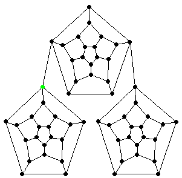

Here, I present a simple BFS code written in Julia using GraphBLAS. This algorithm is taken straight from the API documentation & may not be the fastest method but it's just for a simple illustration.

Okay, so first let's create a SimpleGraph(a LightGraphs type) using the facebook undirected graph from SNAP Datasets and extract it's adjacency matrix.

julia> using GraphBLASInterface, SuiteSparseGraphBLAS, SparseArrays, LightGraphs, SNAPDatasets

julia> g = loadsnap(:facebook_combined)
{4039, 88234} undirected simple Int64 graph

julia> adj = adjacency_matrix(g);


Now we'll extract tuples from this adjacency matrix and convert to 0 based indexing.


julia> I, J, X = SparseArrays.findnz(adj);

julia> I = I.-1; J = J.-1;


Let's build a GraphBLAS adjacency matrix using I, J, X. The number of entries will be twice the number of edges in the graph.


julia> GrB_init(GrB_NONBLOCKING)
GrB_SUCCESS::GrB_Info = 0

julia> A = GrB_Matrix{Int64}()
GrB_Matrix{Int64}

julia> GrB_Matrix_new(A, GrB_INT64, nv(g), nv(g))
GrB_SUCCESS::GrB_Info = 0

julia> GrB_Matrix_build(A, I, J, X, 2*ne(g), GrB_FIRST_INT64)
GrB_SUCCESS::GrB_Info = 0



Now we write a function which performs the BFS traversal of a graph, given the adjacency matrix A and a source node s. It returns GraphBLAS vector v where v[i] is set to the level in which node i is visited. If i is not reacheable from s, then v[i] = 0. The graph A need not be Boolean on input; if it isn't Boolean, the semiring will properly typecast it to Boolean.

julia> function GrB_bfs(                # BFS of a graph (using vector assign & reduce)
                A::GrB_Matrix,          # input graph, treated as if boolean in semiring
                s::GrB_Index            # starting node of the BFS
            )

           #--------------------------------------------------------------------------
           # set up the semiring and initialize the vector v
           #--------------------------------------------------------------------------

           q = GrB_Vector{Bool}()               # nodes visited at each level
           v = GrB_Vector{Int64}()              # result vector
           Lor = GrB_Monoid()                   # Logical-or monoid
           Boolean = GrB_Semiring()             # Boolean semiring
           desc = GrB_Descriptor()              # Descriptor for vxm

           n = GrB_Matrix_nrows(A)              # n = number of rows in A

           GrB_Vector_new(v, GrB_INT64, n)                              # v(n) = 0
           GrB_assign(v, GrB_NULL, GrB_NULL, 0, GrB_ALL, n, GrB_NULL)   # make v dense
           n = GrB_Vector_nvals(v)                                      # finish pending work on v

           GrB_Vector_new(q, GrB_BOOL, n)                               # q(n) = false
           GrB_Vector_setElement(q, true, s)                            # q[s] = true, false elsewhere

           GrB_Monoid_new(Lor, GrB_LOR, false)
           GrB_Semiring_new(Boolean, Lor, GrB_LAND)
           GrB_Descriptor_new(desc)
           GrB_Descriptor_set(desc, GrB_MASK, GrB_SCMP)                 # invert the mask
           GrB_Descriptor_set(desc, GrB_OUTP, GrB_REPLACE)              # clear q first

           #--------------------------------------------------------------------------
           # BFS traversal and label the nodes
           #--------------------------------------------------------------------------

           successor = true        # true when some successor found
           level = 1
           while successor && level <= n
                # v<q> = level, using vector assign with q as the mask
                GrB_assign(v, q, GrB_NULL, level, GrB_ALL, n, GrB_NULL)

                # q<!v> = q ||.&& A ; finds all the unvisited
                # successors from current q, using !v as the mask
                GrB_vxm(q, v, GrB_NULL, Boolean, q, A, desc)

                # successor = ||(q)
                successor = GrB_reduce(Lor, q, GrB_NULL)

                level += 1
           end

           # make v sparse
           GrB_Descriptor_set(desc, GrB_MASK, GxB_DEFAULT)         # mask not inverted
           GrB_assign(v, v, GrB_NULL, v, GrB_ALL, n, desc)

           GrB_free(q)
           GrB_free(Lor)
           GrB_free(Boolean)
           GrB_free(desc)

           return v
       end
GrB_bfs (generic function with 1 method)


(`GrB_ALL` <i>is used to specify all rows/columns of a vector/matrix. The parameter ni/nj is ignored.</i>)

Okay, time to test this. Note that vertices in LightGraphs range from 1:nv(g). While using GraphBLAS the vertices begin with 0.


julia> source = 1;

julia> V = GrB_bfs(A, source-1);

julia> dists = GrB_Vector_extractTuples(V)[2];

julia> dists.-1 == gdistances(g, source)
true


Levels in this algorithm begin at 1 as opposed to `gdistances` where levels begin at 0. Hence, we subtract 1 to compare results.

Thus, we see how one can use GraphBLAS to find geodesic distances.
