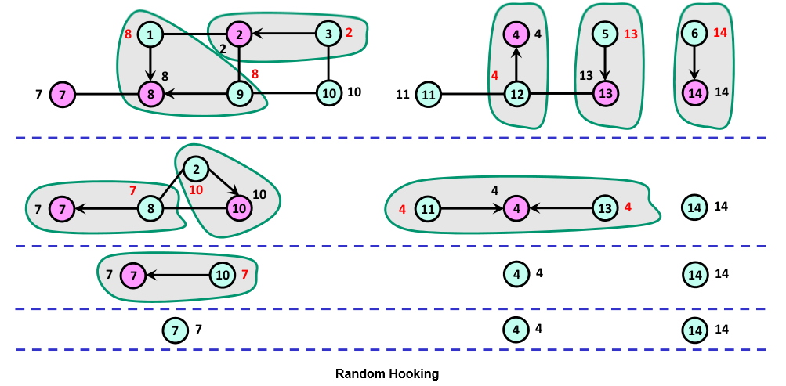

A connected component of an undirected graph is a maximal set of nodes such that each pair of nodes is connected by a path. Connected components can be identified serially using simple traversal (BFS/DFS) or the Union-Find algorithm in `O(|V|+|E|)` time. Generally, Union-Find performs better and I'll be using it to compare benchmarks with the parallel code.

## Basic approach
Connected components can be viewed as a problem of placing nodes in disjoint sets, where nodes belonging to the same set are connected by a path. We use any array `Parent` to denote the membership of vertex `v` in set `Parent[v]`. Initially `Parent[v] = v` for each vertex.

The idea behind this approach is to contract the graph in each iteration by chosing some adjacent vertices and merging them. Vertices belonging to the same set (same parent) are combined and the edges between them are removed for the next iteration. This is demonstrated below -

There are many different ways to do this, each of these methods reduce the number of vertices to atleast half (or one-fourth) after each iteration, which results in `log(|V|)` number of steps, where each step takes a maximum of `O(|V|+|E|)` time -

## Random Hooking
Basically how this works is you perform an unbiased coin toss and assign a value of HEAD/TAIL to every vertex. Then you iterate over all edges and check if one end of the edge(u => v) is HEAD and the other TAIL or vice versa. If so, you make `Parent[u] = Parent[v]`. After this, you perform the graph contraction step and continue to the next iteration till there are no edges left. Each iteration is expected to reduce the number of vertices of positive degree by a factor >= 1/4.

## Deterministic Hooking
This is based on the observation that for an undirected graph with n vertices in which
each vertex has at least one neighbor -

either `|{u | {u, v} ∈ E ∧ (u < v)}| >= n/2`

or `|{u | {u, v} ∈ E ∧ (u > v)}| >= n/2`

So basically you first chose the direction of hooking (i.e., smaller to larger label or larger to smaller label) based on which will hook more vertices.
Then you scan all edges and hook each vertex to a neighbor with larger label (or smaller, depending upon the direction chosen). This ensures that no cycles are formed. Then you use normal pointer jumping to reduce each subtree to a single vertex. An example with hooking direction from smaller to larger is shown below -

You apply this method recursively on the contracted graph and in each step the number of vertices will be reduced by a factor of at least 1/2.

## Opportunistic Pointer Jumping
This method is based on *"Connected-Components algorithms for Mesh-Connected Parallel Computers
Goddard, Kumar and Prins"*.

The method starts with a parent function `P[v] = v` for each vertex and tries to minimize the parent value iteratively until it converges on the solution.

There are three steps in this algorithm,

1) Opportunistic Pointer Jumping: Vertex u finds that out of all its neighbors, v has the smallest numbered parent. Therefore, u changes it parent to `P[w] = P[P[v]]` rather than `P[P[u]]`.

2) Tree Hanging: Vertex u finds that its former child, v, has found a smaller numbered parent during the opportunistic pointer jumping step (i.e., `w = P'[v] < P'[u]`). The tree hanging step changes the parent of u from `P'[u]` to `w = P'[v]`, if w is the minimum of the new parents of the old children of u.

3) Normal Pointer Jumping: `P[u] = P[P[u]]`

Since vertices are always trying to decrease their parent, eventually all connected component are combined and contracted to a single vertex.

The pseudocode for the algorithm is presented below -

## Some notes
**Edge contraction:**
After each step only vertices(v) where `Parent[v] == v` and edges(u => v) where `Parent[u] != Parent[v]` should remain. However, this is an expensive operation and while the number of vertices are halved after each iteration there is no guarantee that the number of edges will be reduced by the same factor. Edge contraction might be useful for huge graphs with uniform degree distribution. Therfore, I did not actually modify the graph after each iteration, instead every vertex is treated as `Parent[v]` and an edge as `Parent[u] => Parent[v]`. The algorithm terminates when then there is no change in `Parent` of any vertex (which corresponds to the case of having no edges left, when using edge contraction).

**Partitioning:**
The first step in each of these method is partitioning the graph and assigning almost equal number of edges to each thread. LightGraphs stores a graph in the form of sorted adjacency lists, so it is not possible to directly use `@threads` macro for `edges(g)` since we cannot do `getindex` operation on the iterator. Although we could write an edge iterator which supports `@threads`, I'm not sure if it'll be effecient since each `getindex` call will take `log(|V|)` time. So, I used a greedy function that partitions the vertex set based on degree.

## Benchmarks
**On 6 threads**

Surprisingly, random hooking was faster than deterministic hooking. This was probably due to the extra step involved in deterministic to scan edges and chose a hooking direction. However, both of them were slower than the serial algorithm (Union-Find). I expect the performance to improve with more cores.

Pointer Jumping outperforms every other approach and gives almost a 2X speedup over the serial algorithm.
