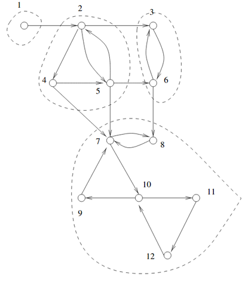
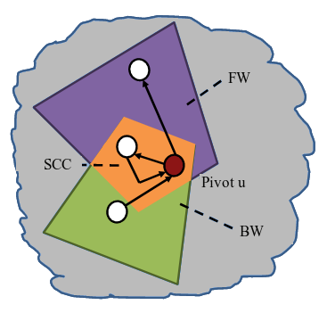

A directed graph is strongly connected if there is a path between all pairs of vertices. A strongly connected component (SCC) of a directed graph is a maximal strongly connected subgraph.
We can find all SCC serially in `O(|V|+|E|)` time using Tarjan or Kosaraju's algorithm. Here we'll use the FW-BW-Trim algorithm for finding all strongly connected components in parallel.

## FW-BW-Trim algorithm
Let's say we pick a vertex u (pivot) in the graph. We represent its descendants (or the vertices discovered in forward sweep) as FWu and ancestors (the backward sweep) as BWu. Then the graph can be partitioned into 4 independent sets -
1. **SCC containing u:** FWu $$ ∩ $$ BWu
2. **Vertices only in FW:** FWu $$ \backslash $$ BWu
3. **Vertices only in BW:** BWu $$ \backslash $$ FWu
4. **Remaining vertices in graph:** V $$ \backslash $$ (FWu $$ ∪ $$ BWu)

Additional SCCs must be completely contained within one of the three partitions. Thus, we recursively apply the algorithm to each of the three partitions besides the pivot’s SCC.
We utilize task parallelism for this.

An optimization to the algorithm is the Trim step which removes all trivial SCCs before starting FW-BW. The procedure is simple: all vertices that have an indegree or outdegree of zero are removed. Trimming can also be performed recursively, as removing a vertex will change the effective degrees of its neighbors.

## Code
`Color[u]` represents the set vertex u belongs to, initially all vertices belong to the same set (`Color[u] = 0`) and we divide this set recursively.

While benchmarking, I found recursive trim did not give any significant speedup, so we'll only perform a single iteration of trim. All trimmed verticed have `Color[u] = -1`.

We use a color generator which generates a unique color for marking descendants(`cfw`), ancestors(`cbw`) and the vertices belonging to the pivot's SCC (`cscc`). The color generator is basically an atomic variable which is incremented everytime we need to get a unique color.

We use DFS for traversing the graph starting from the pivot, although we can also use BFS.

`@spawn` marks any piece of program for execution, and a task will be started to run that code automatically on an available thread. To read more about `@spawn`, refer [here][juliablog].

The new visitor functions in LightGraphs make the code really simple. We just have to import the `newvisitfn!`, which is called whenever a new vertex is discovered during the traversal and modify our traversal state. All visitor functions return a `VisitorReturnValue`. `VSUCCESS` indicates that the traversal should continue normally, while `VSKIP` means that we can skip exploring the current neighbor and move on to the next branch.



using LightGraphs
using Base.Threads
import Base.Threads: @spawn
using SNAPDatasets, BenchmarkTools
using LightGraphs: SimpleDiGraph
import LightGraphs.Traversals: newvisitfn!
using LightGraphs.Traversals: traverse_graph!, TraversalState, DepthFirst
using LightGraphs.Traversals: VSUCCESS, VSKIP

function parallel_scc(g::SimpleDiGraph{T}) where T <: Integer
    color = zeros(Int64, nv(g)) # color[u] denotes the set to which u belongs
    color_gen = Atomic{Int64}(1) # used to generate unique colors
    Vr = Vector{T}() # remaining vertices after trim
    for u in vertices(g)
        if indegree(g, u) == 0 || outdegree(g, u) == 0
            color[u] = -1 # mark trimmed vertices
        else
            push!(Vr, u)
        end
    end
    # recursive fw-bw
    recur_fwbw(0, color, color_gen, Vr)
    return color
end

function recur_fwbw(c::Int64, color::Vector{Int64},
                     color_gen::Atomic{Int64}, V::Vector{T}) where T <: Integer
    isempty(V) && return
    # chose first vertex as the pivot for this set
    pivot = first(V)

    # generate unique colors for marking fw, bw and scc set
    cfw, cbw, cscc = (atomic_add!(color_gen, 1) for _ in 1:3)

    # state for forward sweep, marks all vertices found in forward
    # traversal (i.e ancestors)
    # if color[u] == c, then make color[u] = cfw
    # else prune traversal
    fwstate = FWState{T}(c, cfw, color)
    # state for backward sweep, marks all vertices found in backward
    # traversal (i.e descendants)
    # if color[u] == c, then make color[u] = cbw
    # if color[u] == cfw, then make color[u] = cscc (i.e, part of pivot's SCC)
    # else prune traversal
    bwstate = BWState{T}(c, cfw, cbw, cscc, color)

    color[pivot] = cscc

    # forward traversal
    traverse_graph!(g, pivot, DepthFirst(), fwstate)
    # backward traversal (using inneighbors instead of outneighbors)
    traverse_graph!(g, pivot, DepthFirst(neighborfn = inneighbors), bwstate)

    V_fw = Vector{T}() # vertices only in FW
    V_bw = Vector{T}() # vertices only in BW
    V_c = Vector{T}() # remaining vertices
    for u in V
        if color[u] == cfw
            push!(V_fw, u)
        elseif color[u] == cbw
            push!(V_bw, u)
        elseif color[u] == c
            push!(V_c, u)
        end
    end

    # recur for fw, bw and remaining vertices
    taskcfw = @spawn recur_fwbw(cfw, color, color_gen, V_fw)
    taskcbw = @spawn recur_fwbw(cbw, color, color_gen, V_bw)
    taskc = @spawn recur_fwbw(c, color, color_gen, V_c)
    wait(taskcfw)
    wait(taskcbw)
    wait(taskc)
end

struct FWState{T <: Integer} <: TraversalState
    c::Int64
    cfw::Int64
    color::Vector{Int64}
end

function newvisitfn!(s::FWState{T}, u::T, v::T) where T <: Integer
    # if color[v] != c, no need to explore further from v
    s.color[v] != s.c && return VSKIP
    s.color[v] = s.cfw
    return VSUCCESS
end

struct BWState{T <: Integer} <: TraversalState
    c::Int64
    cfw::Int64
    cbw::Int64
    cscc::Int64
    color::Vector{Int64}
end

function newvisitfn!(s::BWState{T}, u::T, v::T) where T <: Integer
    if s.color[v] == s.c
        s.color[v] = s.cbw
        return VSUCCESS
    end
    if s.color[v] == s.cfw
        s.color[v] = s.cscc
        return VSUCCESS
    end
    # if color[v] != c or cfw, no need to explore further from v
    return VSKIP
end



## Results
I benchmarked the code with 6 threads on many real-world graphs and observed a slowdown of about 2-3X in comparison to Tarjan's algorithm. This slowdown was probably due the following reasons -
1. Most real graphs have a single large SCC, this causes the algorithm to esentially run sequentially. Since we spawn a task for every color, if there's only a single color with a large vertex set, it will reduce parallelism. One solution to increase parallelism is to use parallel BFS for traversal, but this will cause a lot of overhead.

2. Overhead in using `@spawn`: I observed that the code allocated a lot more memory when using spawn, I'm not sure what caused this.

[juliablog]:https://julialang.org/blog/2019/07/multithreading/
