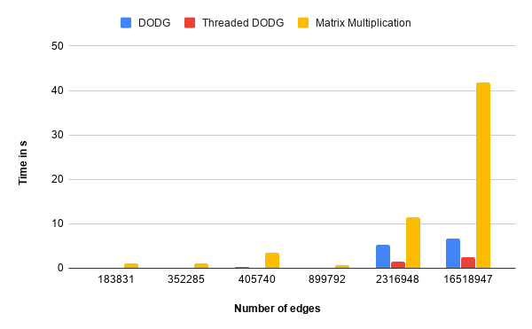

I implemented the Degree-Ordered Directed Graph (DODG) algorithm for triangle counting on undirected graphs. Prior work on this problem was based on adjacency matrix multiplication, which is slow and memory intensive. I also experimented with a parallel version of DODG algorithm and observed that it is fast and scalable.

## Degree-Ordered Directed Graph
Finding triangles is basically enumerating open triads i.e, edges of  the form  $$ \{(a, b), (b, c)\} $$ and checking if a closing edge $$ (a, c) $$ is present in the graph. However, it is not necessary to check all open triads, only one per triangle is needed. The DODG  approach essentially provides a vertex ordering criteria which ensures that only vertex per triangle receives two of its edges. We build a Degree-Ordered Directed graph from the original undirected graph where edges are directed from  low-degree to high-degree. Edges between vertices of equal  degree are directed based on a simple hashed-based tie breaking. Triangles are then counted in the DODG by considering every vertex$$ (u) $$ as pivot and picking a pair of it's neighbors $$ (v, w) $$ i.e, edges $$ \{(u, v), (u, w)\} $$ and checking if the edge $$ (v, w) $$ exists. If $$ (v, w) $$ is found, then the triangle count is incremented. The figure below illustrates conversion of an undirected graph (with $$ d_{p} < d_{q} < d_{r} $$) to DODG :

## Multithreaded Implementation
For the shared-memory parallel implementation, vertices in DODG are greedily partitioned into threads based on their degree and every thread only maintains the triangle count for the vertices that it owns. These counts are summed up to return the total triangle count.

## Adjacency Matrix Method
If $$ A $$ is the adjacency matrix of a graph, then the number of triangles $$ = trace(A^3)/6 $$.
More efficient way to do this :

Let $$ C = A^2 \circ A $$ , where $$ \circ $$ denotes element-wise multiplication  
then $$ n_{T} = \sum_{ij} (C)/6 $$

## Benchmarks
The complete benchmarking code can be found [here][bench]. Six threads were used for the parallel version.

| Graph          | \|V\|   | \|E\|    | Triangles | DODG&nbsp; (time in s)   | Threaded DODG | Matrix Multiplication |
|----------------|---------|----------|-----------|---------|---------------|-----------------------|
| email\-Enron   | 36692   | 183831   | 727044    | 0\.0474 | 0\.0272  		| 1\.1652          		|
| cit\-HepTh     | 27770   | 352285   | 1478735   | 0\.1065 | 0\.0298  		| 1\.1857          		|
| soc\-Epinions  | 75879   | 405740   | 1624481   | 0\.1997 | 0\.0711  		| 3\.3931          		|
| amazon0302     | 262111  | 899792   | 717719    | 0\.1382 | 0\.0836  		| 0\.6483          		|
| flickrEdges    | 105938  | 2316948  | 107987357 | 5\.3215 | 1\.4930  		| 11\.4837          	|
| cit\-Patents   | 3774768 | 16518947 | 7515023   | 6\.6124 | 2\.5186  		| 41\.7712          	|

 

## Results
The DODG implemenation is on average 5-10X faster than the adjacency matrix method on a single core, with a further 2-3X improvement on six cores using shared-memory parallelism.

[bench]:https://github.com/abhinavmehndiratta/TriangleCount